# Over Engineering a Level
Or, the unreasonable effectiveness of low pass filters?

**Michael Nix**, Toronto, Canada, 2026

---

Did you know: humans walk in a completely different manner than airplanes fly?  Did you know: the environment within which humans walk is completely different from the environment within which airplanes fly?  Frankly, I don't like to think too much about it.  Parachute joke.

A few months ago I found these cool little project kits from [Freenove](https://github.com/freenove), and since I have experience with Espressif Systems products, I thought it would be neat to play around with one (I bought the ultimate one for like, fifty bucks off of Amazon, pretty good deal); maybe use it as a proving ground for some of my state estimation ideas, or even as something of a portfolio for professional work.  So I wire up the IMU with some LEDs, getting them to go green when the IMU is pointing down.  A good first step.  Then I was thinking about how to add more and more math stuff in to it; however, everything that involves linear algebra requires some really boring math code.  I looked around for some decent C linear algebra libraries but it was very boring work.  *Then* I remembered that if you keep everything in three dimensions, you can do all the linear algebra by hand.  Put on some tunes, code some terrible functions, and the compiler will probably take care of performance for you.

Which brings us back to humans walking and planes flying.  A while ago I was doing some work analysing how humans move; specifically while moving their arms.  That is, with an IMU strapped to their wrist.  It turns out that waving your arms around requires a pretty hefty amount of acceleration, even when walking.  However, when using acceleration measurements to estimate things, using the force of gravity as a reference for, "down," is a pretty good idea, unless you're distorting it with $\pm 2 g$ of arm waving.  If you were flying a plane way up in the sky, you could ignore acceleration measurements when you know they're wonky, instead using a reference like magnetic north to help out.  But if your IMU doesn't have a magnetometer, or you're inside next to a bunch of electromagnetic interference, you're gonna have some issues.  

So can we adapt normal tools to this kind of situation?

Given the comments above, the most obvious normal tool would be the Mahoney filter.  Specifically the, "explicit complementary filter with bias correction," that doesn't use quaternions.  This gives us a way of combining acceleration measurements, magnetometer measurements, and gyroscope measurements to estimate the rate of change of the attitude of a system with respect to some initial reference frame while compensating for errors in gyroscope measurements.

Here's what the math looks like:

```math
\dot{\hat{\mathbf{R}}} = \hat{\mathbf{R}} \left ( (\mathbf{\Omega}^y - \hat{\mathbf{b}})_\times + k_P \, (\mathbf{\omega}_\mathrm{mes})_\times \right )
```

```math
\dot{\hat{\mathbf{b}}} = -k_I \, \mathbf{\omega}_\mathrm{mes} \\
```

```math
\mathbf{\omega}_\mathrm{mes} = \sum_{i=1}^n k_i \, \mathbf{v}_i \times \hat{\mathbf{v}}_i
```

Where a hat, $\hat{}$, over a letter indicates an estimate; no hat means measurement; each $v_i$ is a unit vector, and they're all orthogonal to one another; b is the bias in the gyroscope, whose rate of change is estimated by the sum of error in unit vector estimates and current measurements (given by their cross product; a rotation); $\Omega^y$ are the gyroscope measurements; a skew, $_\times$, turns a rotation vector into a skew-symmetric rotation matrix (so you can add, multiply, and invert them); $\mathbf{R}$ is a rotation matrix that translates current measurements into your original frame of reference; and all the $k\mathrm{s}$ are gain constants (integral, proportional, whatever).

*Theoretically* the gain constants for $\omega_\mathrm{mes}$ are determined by the existence of eigenvalues of a matrix whose columns are given by your choice of unit vectors, and it only works if you have two or more unit vectors (which we don't), so we'll set those all to one for now.

These unit vectors, $v_i$, are what will define your frame of reference (e.g. north, east, down).  So when you start, you orient yourself in a known good direction, setting your frame of reference. Then $\hat{R}$ will let you change any measurements you collect back to that original frame of reference via multiplication $\hat{R} \, v_i$.  To take measurements in the original frame of reference (e.g. if you need to know where down is *now*), you just multiply them by the transpose, i.e. $\hat{R}^\mathrm{T} \, v_i$.

In order to make this work inside of our computers, we will need to discretize it.  We'll start with the hard part first, and then leave the rest up as an exercise for the reader.  In order to maintain stability as sample rates are reduced, I prefer to use implicit methods for dealing with differential equations, in particular trapezoidal integration or the Crank-Nicolson method.  This means turning our differential into a simple forward finite difference, but the rate of change is equal to the average of the starting point and the ending point.  Similar to the area under a trapezoid when approximating integrals.  This looks like:

```math
\frac{\hat{\mathbf{R}}^{n+1} - \hat{\mathbf{R}}^{n}}{\Delta t} = \frac{1}{2} \left ( \hat{\mathbf{R}}^{n+1} + \hat{\mathbf{R}}^n \right ) \left ( (\mathbf{\Omega}^y - \hat{\mathbf{b}})_\times + k_P \, (\mathbf{\omega}_\mathrm{mes})_\times \right )
```

We then do a quick substitution to make things easier to follow:

```math
\mathbf{R}_p = \frac{\Delta t}{2} \left ( (\mathbf{\Omega}^y - \hat{\mathbf{b}})_\times + k_P \, (\mathbf{\omega}_\mathrm{mes})_\times \right )
```

Re-arrange some matrices:

```math
\hat{\mathbf{R}}^{n+1} \left (\mathbf{I} - \mathbf{R}_p \right ) = \hat{\mathbf{R}^n} \left(\mathbf{I} + \mathbf{R}_p \right)
```

Do a quick inversion, multiplying from the left:

```math
\hat{\mathbf{R}}^{n+1} = \hat{\mathbf{R}^n} \left(\mathbf{I} + \mathbf{R}_p \right) \left (\mathbf{I} - \mathbf{R}_p \right )^{-1}
```

And there you have it, a way of estimating your change in reference frame using existing measurements.  The nice thing about this approach is that the result is still an orthogonal matrix with a determinant of one, so there's no need to then also approximate something else and then normalize it.  This also, if you squint real hard, looks like something of a rotation.  

In this final formulation for estimating $\mathbf{R}$, if you look at the definition of $\mathbf{R}_p$, you can kinda see that this is a complementary filter that combines gyroscope measurements (with bias compensation) with an estimate of rotation that comes from accelerometer measurements (since I don't have a magnetometer).  That means that your rotation matrix will always be updated based on a fraction of acceleration measurements determined by $k_P / (1 + k_P)$, and a fraction of bias compensated gyroscope measurements determined by $1 / (1 + k_P)$.  Looking at how the bias is estimated from its rate of change, you can also tell that $k_I$ determines how quickly bias estimates are updated based on that same acceleration measurement (i.e. the comparison between original down in the current reference frame and the current measurement of down).

These are the parameters we're left with having to think about: how fast we want to update our bias estimate, and, how much we want to trust our accelerometer measurement vs. gyroscope measurement when updating our rotation matrix.  It is more complicated than that, but that's an ok starting heuristic.  Thinking this way can also give us some insight into how we can further reduce error with minimal futzin' about.

You can do something similar with the gyroscope bias, $b$, but that requires turning your vectors into matrices, then following the same method.  Instead it's easier to just do the regular explicit Euler method and pray you're sampling fast enough for stability's sake (also it's easy to check for stability).  I suppose you could also do a piecewise implicit integration on the bias vector, which could be a good compromise.  

However, if you want to start slowing down your sample rate, knowing that you have an unconditionally stable way to integrate values through time is incredibly useful.  You'll still suffer from errors and aliasing, of course, but you'll at least be able to collect data over time, analyze it, and perhaps figure out some compensating controls.  Interestingly, since it's possible to have an unstable bias vector whose only use is in an unconditionally stable system, we don't see what we would expect with an unstable system, i.e. exponential growth in error; however, you do see some wacky extreme oscillations, which is fun.

Somewhere in this repository is a file, probably called `attitude.c/.h`, that gives a sample implementation of this approach in a function most likely called `mahoney_filter`.  Also in the filters component, there is a test folder that contains a MATLAB mex function that can be used to demonstrate how this works.

NOTE: I don't use quaternions, but the Mahoney filter paper does discuss them, and they are recommended as they avoid defects like gimbal lock, and can be more performant.  I find the rotation matrix approach more intuitive to discuss, so that's what I use.  For my use case gimbal lock won't be a problem, nor will performance.

Now, gyroscope bias, $b$, is typically understood as a constant reading of angular velocity when the gyroscope is stationary.  That is, even if the reading should be zero, there is some constant reading--as well as noise, of course.  This is mostly due to mechanical stress, and does happen with accelerometers and magnetometers too; however, those are largely overshadowed by the force of gravity and Earth's magnetic field.  Gyroscopes measure a velocity, so their, "default," values should be zero; i.e. when nothing is moving.  For the MPU-6050 IMU that I'm using, gyroscope readings look like:

<p align=center>
    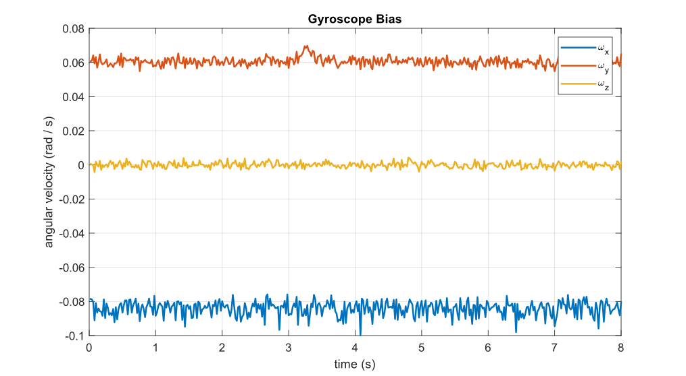<br>
    <i>Figure 1: Gyroscope Bias</i>
</p>

This isn't terrible, but error will very quickly accumulate so that you can't really tell which way you're facing.  And that's what the Mahoney filter aims to correct: using two known good references (down and north), it should be possible to remove bias from gyroscope measurements so that you can figure out which way you're facing as you move around.

To begin to get a sense of how bias can affect measurements, I've captured some sample data that we can take a look at.  It's nothing fancy, I just slowly moved the IMU around on my desk, holding it still for five seconds before pivoting.  First it was flat on my desk, then I picked it up so that the y-axis was about thirty or so degrees off the desk, put it back down; did the same for the x-axis; and then rotated ninety degrees around the z-axis and back.  Here's what that looks like for both accelerometer and gyroscope:

<p align=center>
    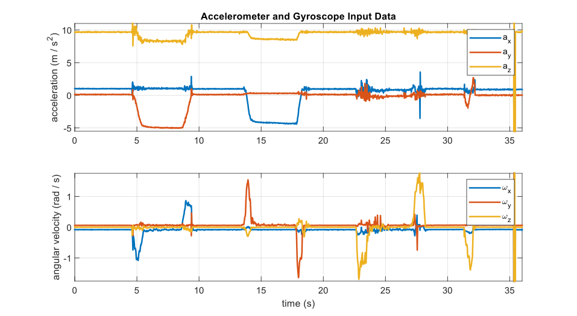<br>
    <i>Figure 2: Accelerometer and Gyroscope Input Data: dt = 0.02</i>
</p>

The bias is still noticeable in the gyroscope measurements which is fun.  But of course you can still see the obvious: lifting up the y-axis requires a rotation about the x-axis, lifting up the x-axis requires rotating around the y.  Then, if you spin it quickly about the z-axis while it's flat, it's obvious what the acceleration looks like: an oscillation along the y-axis (for speeding up and then slowing down (near the very end of the data, around 32 seconds)).

Now, we can try to estimate a rotation matrix using this data by feeding it into our Mahoney filter with no bias compensation and without using accelerometer readings.  To do that, we'll first grab a down vector, and then after every Mahoney filter update we'll take our current reading of down (just the accelerometer reading since gravity is so strong), rotate back to the original reference frame, and compare it with our original down vector.  If the two down vectors match up, we can say that our rotation matrix is pretty good, and that we're on the right track.  In the following figures, we'll label `down` as our original vector, just as three black dashed lines, while the current down vector rotated back to the original reference frame will be labeled $\delta_{x,y,z}$.

To use the Mahoney filter without bias correction, we can just set $k_I$ to zero, and to only use gyroscope measurements we can just set $k_P$ to zero.  This gives us:

<p align=center>
    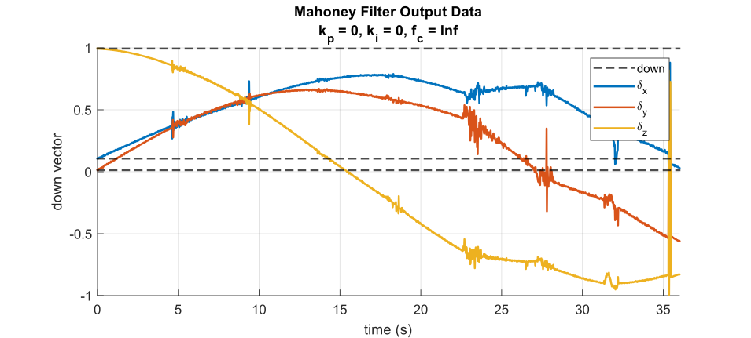<br>
    <i>Figure 3: Mahoney Filter Output: dt = 0.02 s, kp = 0, ki = 0</i>
</p>

Which is exactly what we'd expect when we continuously integrate a constant rate of change in rotation, albeit with little blips when things are legitimately rotated.  To then see what effect using accelerometer measurements have, we can simply turn on $k_P$.  If we set it to one, this becomes a complementary filter where we combine gyroscope and accelerometer measurements equally, then integrate to get our estimated rotation matrix.  

> **NOTE:** to generate the following figures with data and outputs, etc., I used the MATLAB script `plot_test_data.m` in `components/filters/test/` using the provided `test_data.csv` that was pulled from print statements added to the running device, monitored via the ESP-IDF extension for VS Code.  To generate the underlying mex function `test_mahoney`, you have to compile it (if you have MATLAB installed) with `mex -R2018a test_mahoney.c`.

As a reminder, when we say, "use accelerometer measurements," what we mean is we estimate a rotation based on the cross product of the initial down vector brought into the current reference frame with the current down vector (which we assume is the current accelerometer reading).  This will give us a vector that's orthogonal to both, with a magnitude proportional to the angle between the two: some kind of a rotation.

Turning this on gives us:

<p align=center>
    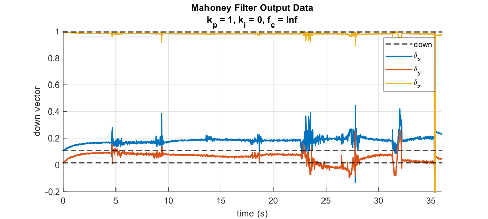<br>
    <i>Figure 4: Mahoney Filter Output: dt = 0.02 s, kp = 1, ki = 0</i>
</p>

This gives us our first hint that something is working.  While not close to perfect, we can see that after a few seconds, our rotation matrix seems to settle down.  That is, except for when the actual rotations occur.  That's to be expected, as that's where most of the noise is, during accelerations.  Even when I tried extra hard to do it smoothly, everything still jiggles a bit when I move it.  However, things still don't settle when acceleration stops, nor do they ever converge back to the normal down.  With these parameters and no bias correction, there will always be at least a constant error in our rotation matrix.

Now, what if we do the opposite: turn off acceleration measurements, and turn on bias correction (which... uses acceleration measurements)?  This means turning $k_P$ down to zero, and $k_I$ up to one:

<p align=center>
    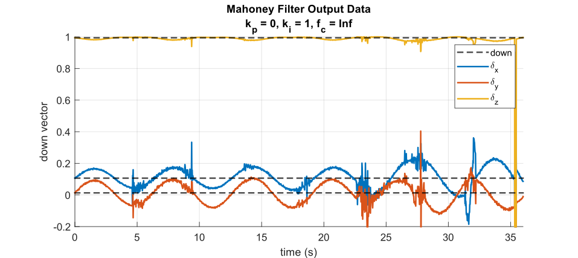<br>
    <i>Figure 5: Mahoney Filter Output: dt = 0.02 s, kp = 0, ki = 1</i>
</p>

For our simplified Mahoney filter (using only the accelerometer readings), the bias calculation is meant to oppose any error determined by the difference in the original down vector when, "compared," to the current down vector.  This means that--even for a stationary device--as bias accumulates error in the rotation matrix, the error between original down and current down rises.  Adjusting the $k_I$ parameter thus adjusts how fast we try to compensate, which results in cool sinusoids that oscillate faster and faster as it rises.  This also means that if you want your filter to respond faster to errors determined by acceleration readings (instead of just matching them via the complementary filter itself), you can crank this parameter up as well.  However, this can also lead to runaway oscillations if raised too high; or, if there is too high an error given by comparison of down vectors.

Now, turning both the bias correction and complementary filter on at the same time gives us more or less what we're looking for:

<p align=center>
    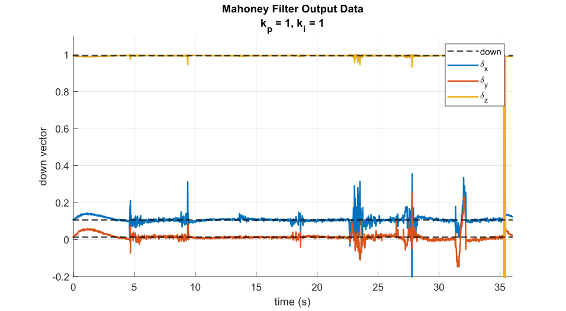<br>
    <i>Figure 6: Mahoney Filter Output: dt = 0.02 s, kp = 1, ki = 1</i>
</p>

This is pretty good!  It takes a few seconds, but the bias does get corrected, and then regardless of orientation, does eventually converge when acceleration is zero.  The only issue is that when there are accelerations, the noise created by the movement can cause some large fluctuations in our estimated down vector.  That is, since this filter assumes that acceleration readings are mostly down (because gravity is so strong compared regular acceleration), any deviation from that assumption shows up directly in our estimate.

There might be a few different ways to improve this.  We can try to ignore acceleration measurements when they deviate too far from what we'd expect gravity to do (i.e. turn $k_P$ down), but that could result in some wacky oscillations that would make our estimate less useful.  So first, we'll just try adjust our parameters.  First, if we increase $k_I$:

<p align=center>
    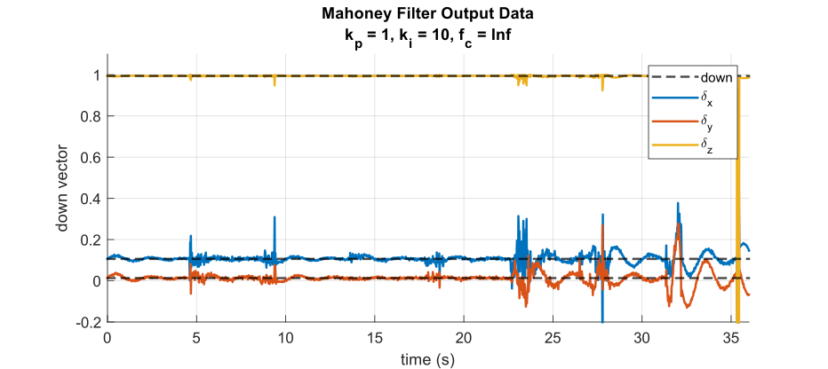<br>
    <i>Figure 7: Mahoney Filter Output: dt = 0.02 s, kp = 1, ki = 10</i>
</p>

All this seems to really do is help us respond faster to changes in orientation; however, if we respond too fast, we overshoot, and oscillate.  Which is what you see near the end of the above when there are larger, less smooth spikes in the acceleration data.  Of course, responding faster also means that the frequency of oscillation is much higher.  Which makes it harder to converge in those moments when there is no acceleration (and thus rotation).  If we had magnetometer measurements that we could also use, this could oppose the oscillations due to bias correction using acceleration (because down and north are orthogonal), but I don't have a magnetometer handy to demonstrate that.  Ok, so that's a bust, but what if we keep $k_I$ at one, and crank $k_P$ up to ten:

<p align=center>
    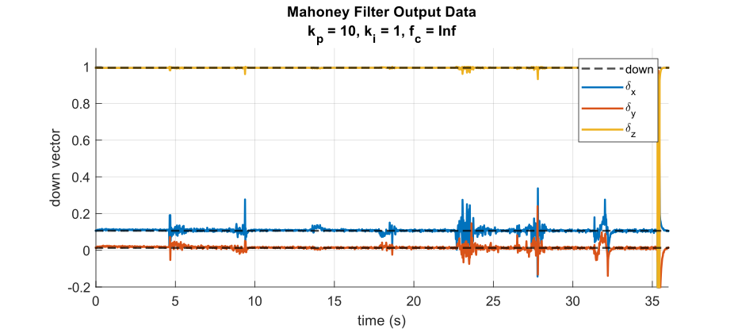<br>
    <i>Figure 8: Mahoney Filter Output: dt = 0.02 s, kp = 10, ki = 1</i>
</p>

This is much better.  It still takes a few seconds to converge, but the initial deviation is never that bad.  You might think, that with $k_P$ cranked up so high relative to gyroscope measurements (which are hardcoded to  gain constant of one), well what do we even need gyroscope measurements for at this point?  Well, that's what makes things converge at all.  That is, when the gyroscope is measuring zero, it's what causes crazy accelerations to not throw things into complete disarray.  I don't have a good graph of this right now as I don't have MATLAB on this computer, but perhaps I'll put it in an appendix when I have a minute.

The only issue that remains are the noisy wiggles when the motion of the device is noisy and wiggly.  Thankfully there's a simple solution for this, a low pass filter.  You might have noticed an $f_c$ parameter mentioned in the title for each one of these graphs, that is the cut-off frequency for a fourth order Butterworth filter, implemented somewhere in this repo (i.e. the `filters` component) in `filters.h/c`.  Infinity for cut-off frequency means... there is no low pass filter.  Butterworth filters are great because they have flat gain in the passband, and reasonably flat group delay--at least for lower order filters that aren't too slow.

If we apply such a filter, with a cut-off frequency of 2 Hz, to our input data things are much cleaner:

<p align=center>
    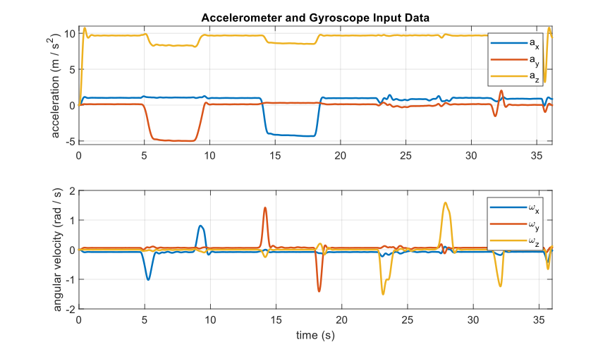<br>
    <i>Figure 9: Filtered Accelerometer and Gyroscope Input Data: dt = 0.02 s, fc = 2</i>
</p>

The nice thing about a cut-off frequency of 2 Hz is that it mostly eliminates the extreme acceleration that we saw at the end of the sequence of original input data due to me bumping the device.  The bad thing about it is the average group delay in the passband is about a quarter of a second.  If you look at the acceleration, "pulses," you can see that there is an offset between the filtered data and the original; that's the group delay.  Remember: phase delay is dispersion, group delay is offset.  A quarter second group delay might not be great for real-time applications, but if you're using it to navigate on a human-esque scale, it's ok.  If you want a faster response time, i.e. lower group delay, a 5 Hz cut-off frequency would give you a group delay of a few milliseconds.  That's typically how smartphone gravity filters work: low pass filter acceleration data, then normalize it so that its magnitude matches approx. 9.80665 m / s / s

If we then use this data to feed our filter, with the above pre-determined parameters for $k_I$ and $k_P$, we get:

<p align=center>
    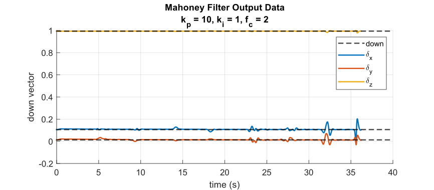<br>
    <i>Figure 10: Mahoney Filter Output: dt = 0.02 s, kp = 10, ki = 1, fc = 2</i>
</p>

And that's much better.  With the caveat that this is... an incredibly small set of data, and an incredibly unrealistic test.  In some previous work, I noticed that genuine human movement (not just arm waving) takes place around and below 0.5 Hz; knowledge that could help us tune our level so that it's more realistic.  Though filtering at that cut-off with otherwise the same filter increases group delay to over three quarters of a second, on average.  So you really do need to understand your system and how it moves in order to get the best results out of these things.  You can always guess at the mechanics of things, jam it into an adaptive filter like a Kalman filter and (if properly implemented) it will converge (eventually), but I dunno.

So where's the level?

As of February 2026, this is a pretty terrible level.  The moment you turn this thing on, it takes an accelerometer reading and then uses this as the original reference frame's down.  It then lights up some LEDs green if any further readings can be translated back to that original reference frame and match that down vector.  The LEDs are red if they're too far off, and yellow somewhere in between.  Red and yellow LEDs will line up in a little arrow pointing in the direction you need to tilt the device to get to level.  Which is fine, but this means that in order to work, you first have to find a level surface to put the thing on, hah.

Of course, I could update this to calibrate a down vector the moment it becomes level (i.e. when acceleration is pointing along the z-axis (which is physically down in our case), and has the correct magnitude); or like, add a button so that you can manually calibrate it.  And I might do that later when I have some time.  Unfortunately you need a direct, more or less continuous, series of measurements from the calibrated vector to your current measurements in order to keep track of the rotation matrix that translates from your current reference frame to your original.

Could you use this for navigation?  Probably, it might not be as accurate, but because translations between references frames do eventually converge, you could wait for down vectors to line up in the original reference frame, take measurements and then translate them back.  This will allow you to keep track of movement in a way that makes sense so that you can orient yourself.  Doing it continuously--especially if you want to accumulate acceleration--to track displacement would still give you issues; the same issues you always have unless you have an external measurement you can also rely upon.  However, if you wanted to try you'd have to, in its current form, align it correctly with down and north, then turn it on.  That way any measurements you take can be brought back into a reference frame that should be aligned with north and down; though you won't have a north reference to compare it to.

## Appendix A: README.md

I forgot the actual README.

This was built using a starter kit from Freenove so that I could build out a library of low level drivers for various types of peripherals using various types of interfaces and communication protocols.  And, as I said above, play around with some math stuff.

This firmware was written in VS Code using the ESP-IDF Extension, with ESP-IDF v5.5.2, and tries to conform to those standards.  That is, if you clone this repo, and open it in VS Code with the ESP-IDF Extension installed, with v5.5.2 of the IDF installed, you should just be able to hit the build button and it'll work.

The hardware consists of:
- ESP32-WROVER microcontroller with GPIO extension board,
- MPU-6050 6-axis IMU,
- WS2812 RGB LED module.

All put together, things look like:

<p align=center>
    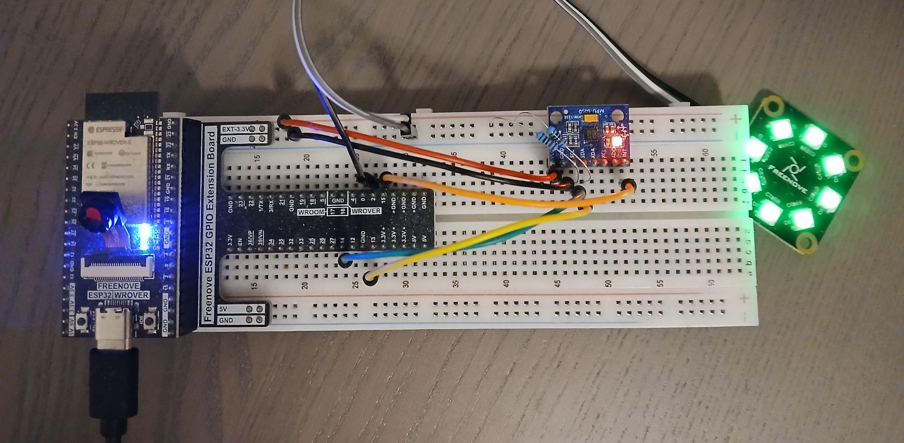
    <i>Figure A1: The Level in Question</i>
</p>

The IMU is controlled using an I2C connection from the ESP32 to the MPU6050, and the LEDs are controlled using the ESP's RMT as a pulse width modulator.  Datasheets can be found in the relevant component's `/docs/` folder.  The pin layout is:

| Device        | Line | GPIO Pin |
|---------------|------|----------|
| **MPU-6050**  | SDA  | IO13     |
|               | SCL  | IO14     |
|               | INT  | IO15     |
| **WS2812**    | DIN  | IO2      |

The IMU also has two 10 $\mathrm{k\Omega}$ pull-up resistors on the SCL / SDA lines.

The general flow of the program is:
- The main task (`main/main.c`) initializes the underlying peripherals (IMU, LED), sets up shared data structures, monitors task memory, and starts other tasks:
  - The three other tasks are the IMU task, data task, and LED task,
- The IMU task (`main/tasks/imu_task.c`) sets a periodic timer, and when it expires it copies data from the IMU buffer to a local buffer--which is also shared with the data task--then signals the data task that there is new data ready,
- The data task (`main/tasks/data_task.c`) is where all of the math happens; once the IMU task updates the shared buffer, it filters the new data, updates an estimate on the rotation matrix, and tells the LED task in which direction with which colour to point the LEDs,
- The LED task (`main/tasks/led_task.c`) simply receives data from the data task and updates the colours of the LEDs.

Pins and general settings for each peripheral can be found in its respective driver header, e.g. `led_driver.h`, or `imu_driver.h`, or `filters.h` to change the parameters for the underlying filters (low pass, Mahoney) and their data buffers.

> **NOTE:** The MPU-6050 I have has a FIFO buffer of only 512 bytes, instead of 1024 bytes like it says in the datasheet, which is weird.  Also, the reason I set it to sample at 1 kHz and average samples after filtering in order to get down to 50 Hz was just 'cause I wanted to see how fast I could get things to work.
